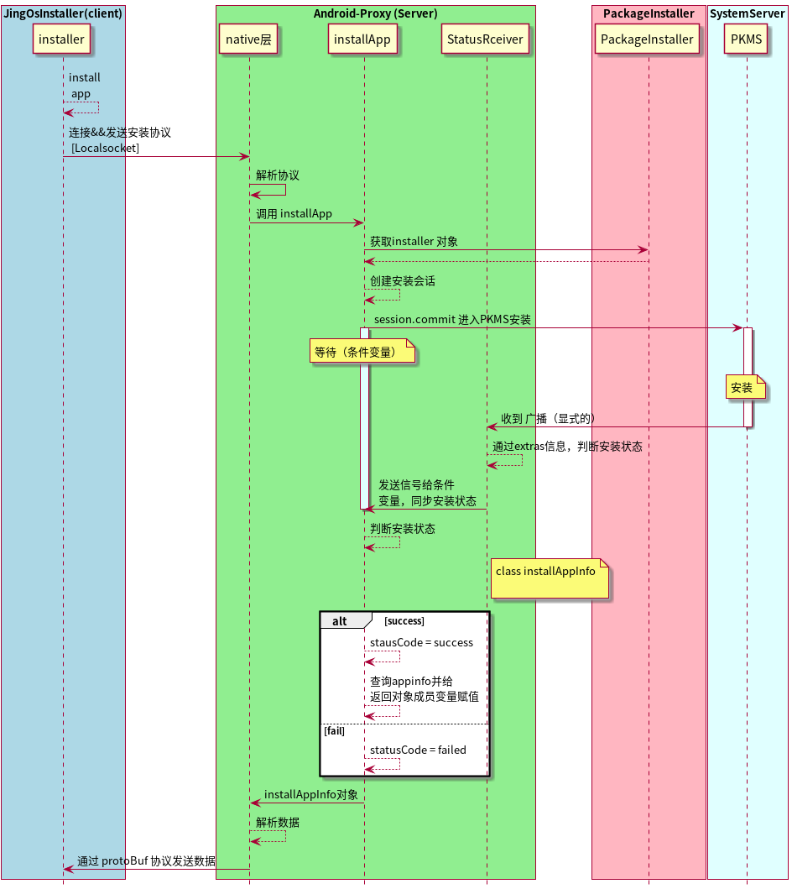
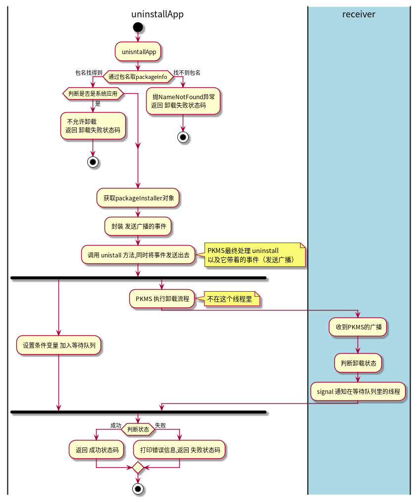

# AndroidSideProxy

> Android 侧代理服务

## 使用说明

1. clone 本项目到aosp/packages/apps
2. 从gerrit上克隆 JingSideProxy到本工程的根目录，记得选择main_dev分支。

## 接口文档

### 1. installApp

 ***时序图*** ：  

### 2. uninstallApp

 ***流程图*** ：  

